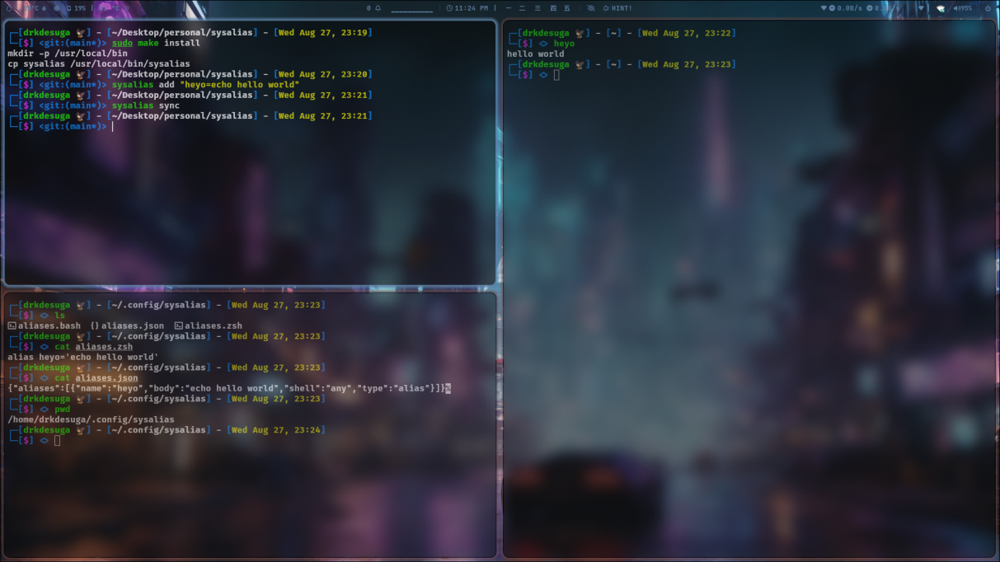
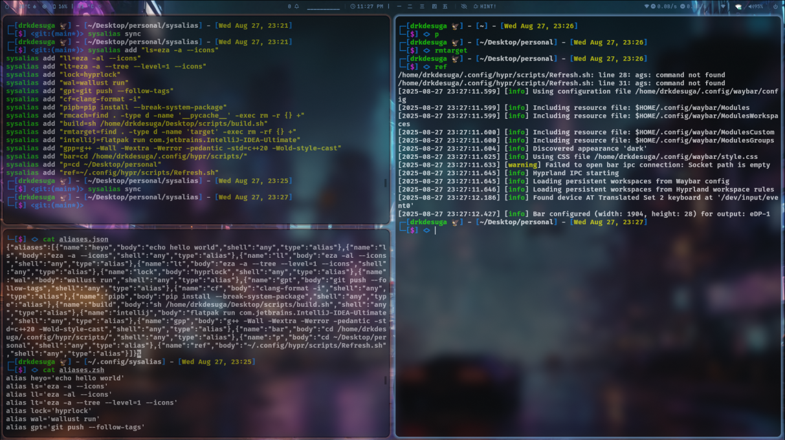

# sysalias

`sysalias` is a lightweight C tool to manage your shell aliases (bash and zsh) in a centralized way.

It allows you to:

-   Add, remove, and list aliases stored in a single JSON registry
    
-   Synchronize automatically with your `.bashrc` and `.zshrc`
    
-   Generate clean fragment files (`aliases.bash`, `aliases.zsh`)
    
-   Run integration checks with `doctor`
    
-   Import and export aliases for backup or sharing
    

> ⚠️ **Important:** every time you add or remove an alias, you must run `sysalias sync` to regenerate fragments and update your shell configuration.

----------

## ⚙️ Installation

### Using `make`

Build the binary:

```bash
make

```

Install system-wide into `/usr/local/bin` (requires sudo):

```bash
sudo make install

```

Uninstall:

```bash
sudo make uninstall

```

Clean build artifacts:

```bash
make clean

```

Create a `dist/` directory with the compiled binary:

```bash
make dist

```

### Using scripts

You can also install/uninstall with the provided helper scripts:

```bash
./scripts/install.sh       # installs into ~/.local/bin
sudo ./scripts/install.sh --system   # installs into /usr/local/bin

./scripts/uninstall.sh
sudo ./scripts/uninstall.sh --system

```

----------

## 🚀 Usage

```bash
sysalias help

```

### Commands

-   **add**
    
    ```bash
    sysalias add NAME=BODY
    sysalias add --shell bash NAME=BODY
    sysalias add --shell zsh NAME=BODY
    
    ```
    
    Add an alias. `--shell` restricts the alias to bash or zsh, otherwise it is shared (`any`).  
    After adding, run `sysalias sync`.
    
-   **rm**
    
    ```bash
    sysalias rm NAME
    
    ```
    
    Remove an alias by name. Run `sysalias sync` afterwards.
    
-   **list**
    
    ```bash
    sysalias list
    
    ```
    
    List all aliases in the registry.
    
-   **sync**
    
    ```bash
    sysalias sync
    
    ```
    
    Generate `aliases.bash` and `aliases.zsh` fragments, then inject the sysalias block into your `.bashrc` and `.zshrc`. Idempotent.
    
-   **doctor**
    
    ```bash
    sysalias doctor
    
    ```
    
    Run health checks: registry exists, fragments exist, rc files contain sysalias block, no duplicate aliases.
    
-   **export**
    
    ```bash
    sysalias export > backup.json
    
    ```
    
    Export the registry as JSON.
    
-   **import**
    
    ```bash
    sysalias import backup.json
    
    ```
    
    Replace current registry with the given JSON file. Run `sysalias sync` afterwards to propagate changes.
    
-   **help**
    
    ```bash
    sysalias help
    
    ```
    
    Show usage.
    
-   **version**
    
    ```bash
    sysalias version
    
    ```
    
    Print version.
    

----------

## 🧪 Development

-   Build:
    
    ```bash
    make
    
    ```
    
-   Run tests:
    
    ```bash
    tests/run_tests.sh
    
    ```
    

----------

## 📂 Project structure

```
sysalias/
├─ include/        # headers
├─ src/            # implementation
├─ scripts/        # install/uninstall scripts
├─ tests/          # test suite
├─ Makefile        # build rules
└─ README.md

```

## EX :





## 📜 License

This project is licensed under the GNU General Public License v3.0 (GPLv3).

Copyright (C) 2025  DRKdesuga

You may redistribute and/or modify this project under the terms of the GNU GPL,
either version 3 of the License, or (at your option) any later version.

See the [LICENSE](LICENSE) file for the full text.
